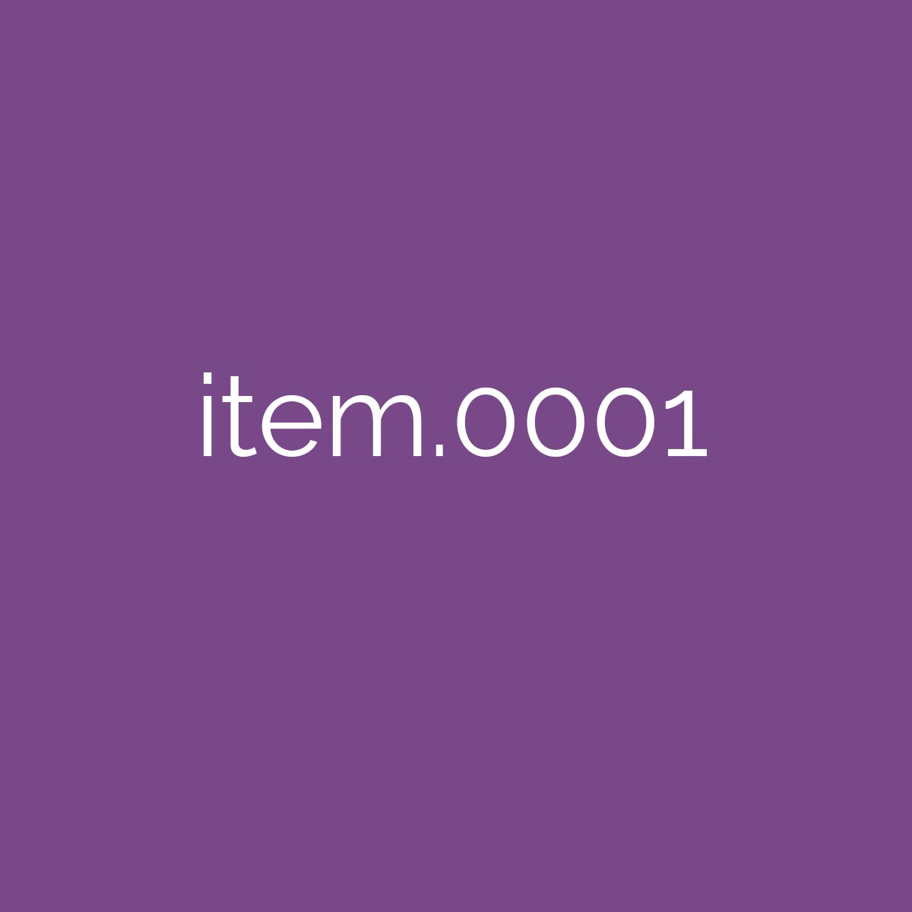

# Omeka S Import Instructions

This repo has a few files to help test Omeka S import. 

## Before you start

You will need to install the Omeka S "[CSV Import](https://omeka.org/s/modules/CSVImport/)" plugin and "[File Sideload](https://omeka.org/s/modules/FileSideload/)" plugin. Note that some plugins also require the "[Generic](https://github.com/Daniel-KM/Omeka-S-module-Generic)" plugin. 

### Configuring Sideload

To configure the sideload plugin, you need to give it a directory to look in for images. In this example I created a "sideload_files" folder in my omeka s install folder. Here is the folder highlighted along with the relative and absolute paths. 

Here is where I put all those path parts together to fill out the "Sideload directory"

Finally, I uploaded the images from the "images" folder into the sideload_files folder. 

|       |  |       |  |  |
| ----------- | ----------- | ----------- | ----------- | ----------- |
|  |  |  |  |  |

## Create resource template (OPTIONAL)

You might want to create a [resource template](https://omeka.org/s/docs/user-manual/content/resource-template/) to contain your items. I have created a [template you can import](templates/test_template.json) that fits this test data. 

## Your First Import

First you will import the first test import CSV, located in import/omeka_import.csv. 

On first import, you'll need to set options for two fields

for `dcterms:accessRights` you will need to set the data type to "URI" by clicking the wrench icon

for `Image ID` you will need to set the mapping to "sideload" 

Be sure to save your settings with the "Apply Changes" button in the lower right, it's easy to forget!

OPTIONAL: On the basic Settings tab, choose the resource template you imported. 

Finally, click on "Import". If all goes well, you should see items in your items. If it hasn't gone well (for instance 0 items added), you should see a link to the log so you can check what went wrong. 

## Subsequent Imports

I have provided a second CSV in import/omeka_import_v2.csv. 

If you add more to the CSV file and import as before, you will get duplicate entries. To prevent this, you must have a unique field in your CSV that can be used to check if an item is the same. This can be any field, but it's reccomended to use an internal ID. 

With our example CSV's, we can use the dcterms:identifier field to compare. I have chosen the option "Revise data of the resource" which will update all data unless all fields are empty. You'll also want to select the "Create a new resource" option under "Action on unidentified resources."

If all goes well, you will have 10 total items, and the original 5 items should ahve an uptated title. 
